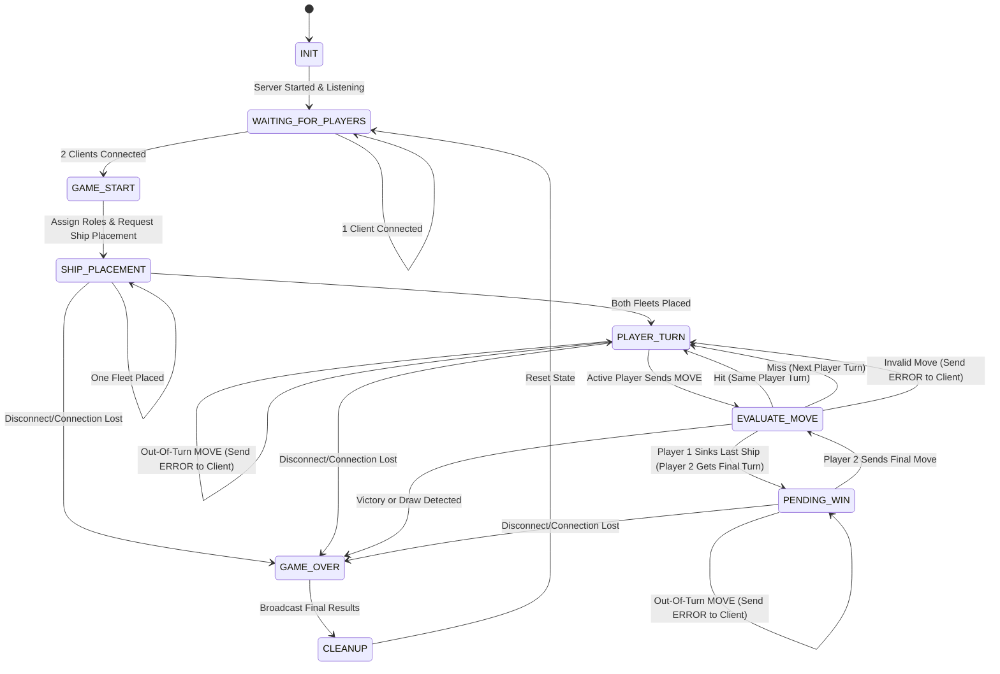

# Game Finite State Machine (FSM) Specification

## 1. State Diagram

## 2. Edge Cases & Error Handling
- **Out-of-Turn Move:** if the inactive player sends a MOVE, the server replies with ERROR (error_code = OUT_OF_TURN_MOVE). The board is not changed and server stays in PLAYER_TURN, waiting for active player to send their MOVE. 
- **Invalid Move:** In EVALUATE_MOVE, an invalid coordinate (INVALID_COORDINATES) or an already-guessed cell (CELL_ALREADY_GUESSED) gets an ERROR reply. The board is not changed and the same player gets to go again.
- **Malformed Message:** A message that can't be parsed or is missing fields gets ERROR (MALFORMED_MESSAGE), and the state doesn't change.
- **Disconnect(planned or not):** All three cases from blueprint protocol lead to GAME_OVER with outcome = FOREFEIT and reason = OPPONENT_DISCONNECTED: 
- **Win and Draw Rules:** Player 1 always goes first in a round, so there are two different cases:
    1. Player 1 sinks the last ship: Player 2 hasn't had their turn yet this round, so the game goes to PENDING_WIN and Player 2 gets one last turn. If player 2 also sinks every ship, it's a draw (outcome = DRAW, reason = MUTUAL_SINK, winner = null). If player 2 misses, Player 1 wins (outcome = WIN, reason = ALL_SHIPS_SUNK, winner = Player 1)
    2. Player 2 sinks the last ship: Since Player 1 already had their turn this round, Player 2 wins immediately (outcome = WIN, reason = ALL_SHIPS_SUNK, winner = Player 2)
- **New Match:** After CLEANUP, the server loops back to WAITING_FOR_PLAYERS so it can host another match.