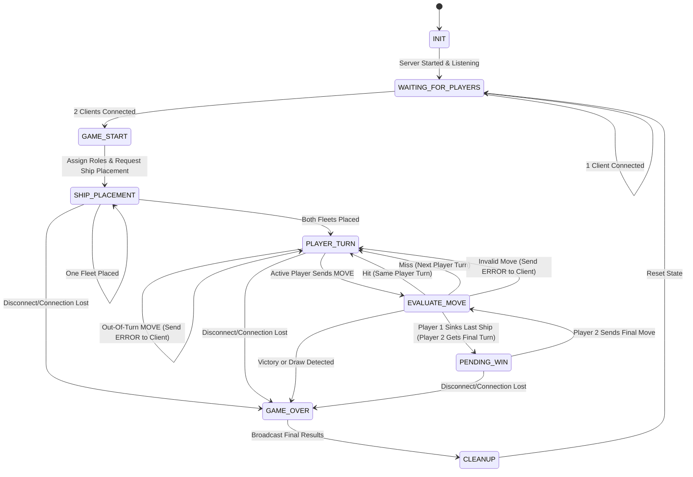

# Game Finite State Machine (FSM) Specification

## 1. State Diagram

```mermaid
stateDiagram-v2
    [*] --> INIT
    INIT --> WAITING_FOR_PLAYERS: Server Started & Listening
    WAITING_FOR_PLAYERS --> WAITING_FOR_PLAYERS: 1 Client Connected
    WAITING_FOR_PLAYERS --> GAME_START: 2 Clients Connected
    GAME_START --> SHIP_PLACEMENT: Assign Roles & Request Ship Placement 
    SHIP_PLACEMENT --> GAME_OVER: Disconnect/Connection Lost
    SHIP_PLACEMENT --> SHIP_PLACEMENT: One Fleet Placed
    SHIP_PLACEMENT --> PLAYER_TURN: Both Fleets Placed
    PLAYER_TURN --> PLAYER_TURN: Out-Of-Turn MOVE (Send ERROR to Client)
    PLAYER_TURN --> EVALUATE_MOVE: Active Player Sends MOVE
    PLAYER_TURN --> GAME_OVER: Disconnect/Connection Lost
    EVALUATE_MOVE --> PLAYER_TURN: Hit (Same Player Turn)
    EVALUATE_MOVE --> PLAYER_TURN: Miss (Next Player Turn)
    EVALUATE_MOVE --> PLAYER_TURN: Invalid Move (Send ERROR to Client)
    EVALUATE_MOVE --> GAME_OVER: Victory or Draw Detected
    EVALUATE_MOVE --> PENDING_WIN: Player 1 Sinks Last Ship (Player 2 Gets Final Turn)
    PENDING_WIN --> GAME_OVER: Disconnect/Connection Lost
    PENDING_WIN --> EVALUATE_MOVE: Player 2 Sends Final Move
    GAME_OVER --> CLEANUP: Broadcast Final Results 
    CLEANUP --> WAITING_FOR_PLAYERS: Reset State
```

